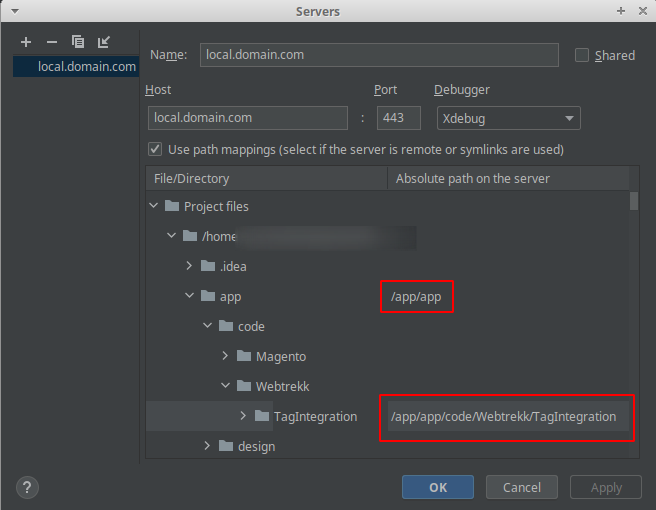

# End to End test suite - Mapp Cloud / Magento 2

The server can be reached under

https://local.domain.com

&nbsp;

## Makefile directives 
&nbsp;

### prepare-host 
    Adds execution rights to scripts, created app directory for app volume within E2E/install directory

### install-23
    Starts Mapp network and installs 2.3 version of Magento by pulling the repos, checking the version out and then starting the install process. Will use backup of plugin code if available.
 
### install-24
    Starts Mapp network and installs latest 2.4-developer version of Magento by pulling the repos, checking the version out and then starting the install process. Will use backup of plugin code if available.
 
### old-server-start
    Starts the server with PHP 7.3, which is needed for Magento 2.3 -> needs to be installed first. Will be saved in volume. Creates network 'Mapp'.

### server-start
    Starts the server -> needs to be installed first. Will be saved in volume. Creates network 'Mapp'.
 
### dev-server-start
    Same as server-start, but with xdebug activated (which is slower).

### old-dev-server-start
    Same as server-start, but with xdebug activated (which is slower) and PHP 7.3.

### stop-server
    Stops the server, shuts down docker network 'Mapp'.
 
### tests
    Runs the tests, given that the server is already started.
 
### run-tests
    Starts the server, runs the tests, closes the server.
 
### jenkins-test
    Complete test routine for Jenkins: host will be prepared, server started, app-volume reset, db reset, version 2.4-developer installed, tests will run, server will be stopped.

### jenkins-test-complete
    Complete test routine for Jenkins: host will be prepared, server started, app-volume reset, db reset, version 2.3 and 2.4, tests will run, server will be stopped.
 
### exec 
    Bash shell into Magento container.

### cypress 
    Bash shell into Cypress container.
 
### uninstall
    Uninstalls currently installed Magento version. Will keep the Magento repos under /app/sources though and creates a backup of Mapp Cloud plugin code inside add volume.

### uninstall-mapp
    Uninstalls the backup of Mapp Cloud plugin.

### empty-carts
    Removes all items from carts - if an order test fails, the items remain when there is no uninstall between the tests. Use this to avoid assertion errors due to that.
 
### flush
    Flushed the Magento 2 cache.
 
### upgrade
    Runs setup:upgrade of the Magento binary.
 
### log-debug
    Logs system.log of Magento app (PHP errors etc.) 
 
### plugin-backup
    Makes a backup copy of Mapp Plugin code inside the container. This backup is used to install by default. Use make uninstall-mapp to delete backup.
 
### plugin-restore
    Restores Mapp plugin code from within the container. 

### plugin-copy-app-to-volume
    Copies Mapp plugin code from within the container into the volume (src directory in project). 

### plugin-install
    Copies Mapp plugin from volume (src directory in project) into app. 


---
 &nbsp;
 ## Xdebug config
 ### IntelliJ  
 

 ### VSCode
 launch.json
``` json
{
    "version": "0.2.0",
    "configurations": [
        {
            "name": "Magento 2 XDebug",
            "type": "php",
            "request": "launch",
            "port": 9000,
            "stopOnEntry": false,
            "pathMappings": {
                "/app/": "${workspaceFolder}/E2E/install/app/",
                "/app/app/code/MappDigital/": "${workspaceFolder}/src/MappDigital/"
              },
        }
    ]
}
```
Run `make plugin-install` to apply changes in src directoy to running server. For certain changes you also need to run `make upgrade` or `make flush`.