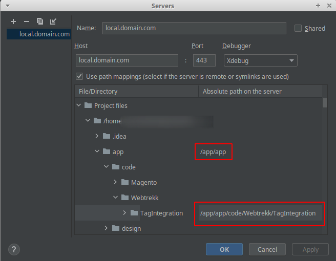

# End to End test suite - Mapp Cloud / Magento 2

The server can be reached under

https://local.domain.com

&nbsp;

## Makefile directives 
&nbsp;

### prepare-host 
    Adds execution rights to scripts, created app directory for app volume within E2E/install directory

### cleanup-host:
    Deletes everything inside app directory from within php server, so `make server-start` has to be executed before

### install
    Starts Mapp network and installs latest 2.4-developer version of Magento by pulling the repos, checking the version out and then starting the install process. Will use backup of plugin code if available.
 
### server-start
    Starts the docker containers
 
### dev-server-start
    Same as server-start, but with xdebug activated (which is slower).

### stop-server
    Stops the docker containers
 
### tests
    Runs the tests, given that the server is already started.
 
### exec 
    Bash shell into Magento container.

### cypress 
    Bash shell into Cypress container.
 
### uninstall
    Uninstalls currently installed Magento version. Will keep the Magento repos under /app/sources though and creates a backup of Mapp Cloud plugin code inside add volume.

### uninstall-mapp
    Uninstalls the backup of Mapp Cloud plugin.

### empty-carts
    Removes all items from carts - if an order test fails, the items remain when there is no uninstall between the tests. Use this to avoid assertion errors due to that.
 
### flush
    Flushed the Magento 2 cache.
 
### upgrade
    Runs setup:upgrade of the Magento binary.
 
### log-debug
    Logs system.log of Magento app (PHP errors etc.) 
 
### plugin-backup
    Makes a backup copy of Mapp Plugin code inside the container. This backup is used to install by default. Use make uninstall-mapp to delete backup.
 
### plugin-restore
    Restores Mapp plugin code from within the container. 

### plugin-copy-app-to-volume
    Copies Mapp plugin code from within the container into the volume (src directory in project). 

### plugin-install
    Copies Mapp plugin from volume (src directory in project) into app. 


---
 &nbsp;
 ## Xdebug config
 ### IntelliJ  
 

 ### VSCode
 launch.json
``` json
{
    "version": "0.2.0",
    "configurations": [
        {
            "name": "Magento 2 XDebug",
            "type": "php",
            "request": "launch",
            "port": 9000,
            "stopOnEntry": false,
            "pathMappings": {
                "/app/": "${workspaceFolder}/E2E/install/app/",
                "/app/app/code/MappDigital/": "${workspaceFolder}/src/MappDigital/"
              },
        }
    ]
}
```
Run `make plugin-install` to apply changes in src directoy to running server. For certain changes you also need to run `make upgrade` or `make flush`.

## Possible issues
### Cannot start server (dev or regular)
```
Error response from daemon: driver failed programming external connectivity on endpoint local.domain.com (924b9aff4491280ba4e2e80a1ea4096fdb597b14285279138d2689164726a304): Error starting userland proxy: listen tcp4 0.0.0.0:80: bind: address already in use
make: *** [Makefile:30: dev-server-start] Error 1
```

Most likely Apache is running locally listening for port 80. \
Resolution: map docker port 80 to port 8080 in Test/E2E/install/docker-compose.yaml (use `8080:80` instead of `80:80`)

### Unable to create-project since authentication issue
during `make install`. Even describing auth details manually cannot solve issue \
_**see env.example from project root**_